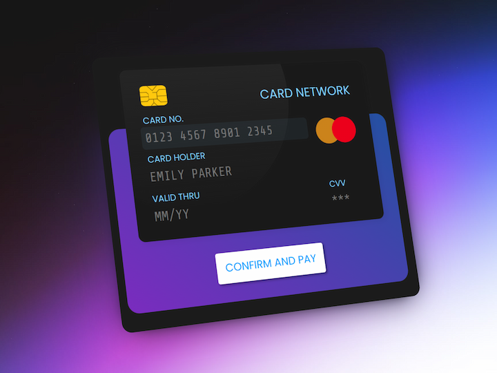

# Credit/Debit Card Validator

Lightweight, dependency‑free web component for real‑time credit and debit card validation and UX‑friendly formatting.

## ✨ Features

- Auto‑formatting card number
  - `4‑4‑4‑4`, `4‑6‑5`, `4‑6‑4`, etc. (cursor smart‑jumps)
- **Network detection & Regex checks**
  - See the full list in `app.js` under `cardPatterns`
- **Sanitization & Length control** – digits only, no overflow
- **Luhn checksum** – algorithm implemented
- **Allowed‑keys filter** – prevents invalid keystrokes
- **Card‑holder name validation** – Supports Latin letters, spaces, diacritics, apostrophes, periods, and hyphens (via regex)
- **Expiry date UX** – live format; final validity pending
- **“Valid Thru” & CVV rules** – length tied to detected network
- **Accessibility** – Semantic HTML with proper ARIA attributes for screen reader support
- Pure **HTML / CSS / Vanilla JS** – no libraries, no build step

### 🛠️ Technologies Used

- HTML
- CSS
- JavaScript (Vanilla)

### ⏳ Roadmap

- Final expiry date range validation
- Luhn auto‑toggle

> The only logo of network is visa for demo

## 🚀 Getting Started

Just clone and open `index.html` in your browser.

## 📸 Preview

> Disclaimer: For demo / educational use only.
